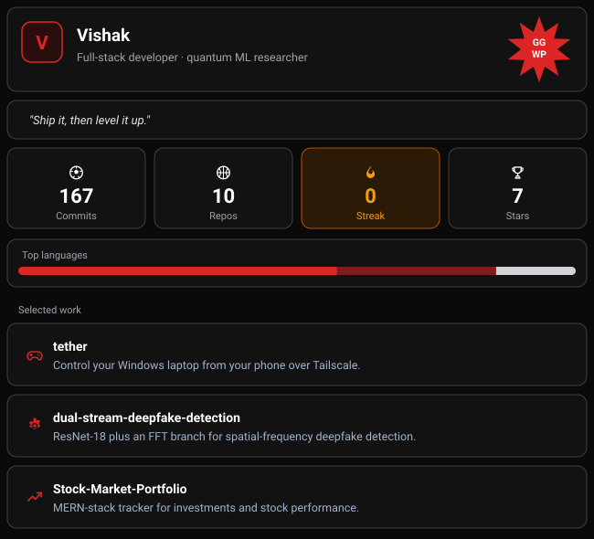

  <a href="https://github.com/Vishak05/tether">tether</a> &nbsp;·&nbsp;
  <a href="https://github.com/Vishak05/dual-stream-deepfake-detection">dual-stream-deepfake-detection</a> &nbsp;·&nbsp;
  <a href="https://github.com/Vishak05/Stock-Market-Portfolio">Stock-Market-Portfolio</a> &nbsp;·&nbsp;
  <a href="https://github.com/Vishak05?tab=repositories">all repos</a>

  

 

<picture>
  <source media="(prefers-color-scheme: dark)" srcset="https://raw.githubusercontent.com/Vishak05/Vishak05/output/snake-dark.svg" />
  <source media="(prefers-color-scheme: light)" srcset="https://raw.githubusercontent.com/Vishak05/Vishak05/output/snake-light.svg" />
  
</picture>

